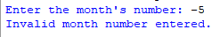
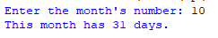
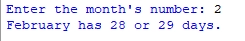

## Description
This program prompts the user to input a month number and then determines the number of days in that month, displaying the result.
## Example
♡ Example 1   
   
♡ Example 2    
  
♡ Example 3    

